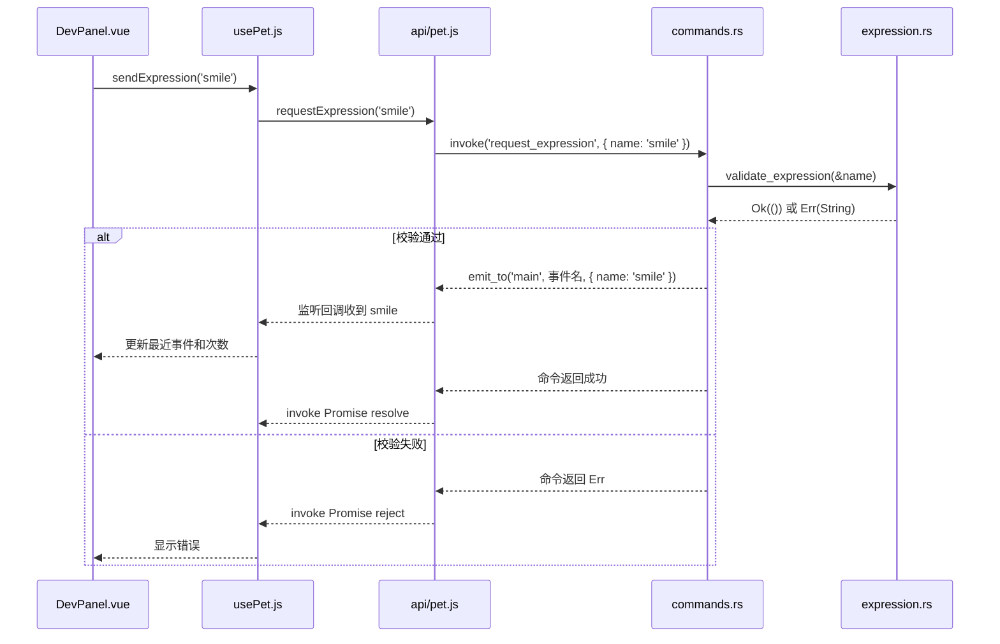

# 第二步：Vue ↔ Rust 双向通信

这一阶段把本地计数按钮换成开发联调面板。点击表情按钮后，Vue 调用 Rust；Rust 校验名称，再向 `main` 窗口发送事件，Vue 收到后显示表情名和接收次数。模型接入在第三步进行。

第三阶段更新：当前代码已经加载模型，`usePet()` 由 `App.vue` 创建一次并共享给面板与模型组件；本文讲解的 Rust 命令和事件协议保持一致。收到事件后如何改变真实表情，见 [第三步](03-model.md)。

## 先运行，再对照代码

```powershell
cd D:\AnChiProject\yachiyodesktop\app
pnpm tauri dev
```

先等面板出现“事件监听已就绪”。然后点击“微笑”，观察两块内容：

- **命令返回**：显示“请求已发送：smile（Rust 命令成功返回）”。
- **最近一次事件**：显示“收到 Rust 事件：smile”，接收次数增加 1。

再点“测试错误：unknown”，应显示“未知表情: unknown”；最近一次成功事件和事件次数保持不变。最后再点一个有效表情，错误会清除，事件次数继续增加。

面板仅在开发模式显示。`pnpm build` 的生产页面不会显示联调按钮。

## 一次点击的完整路径



图中表达的是两条通知路径；前端不依赖命令返回与事件回调的先后顺序。命令成功说明 Rust 已完成校验并成功调用事件发送接口，不能据此证明 Vue 已收到事件，更不代表模型已经执行了表情。

后续托盘或其他 Rust 逻辑也可以发送同一个事件，驱动前端的表情处理。

## 建议先读 Rust 的三个位置

### 1. lib.rs：把模块接入，把命令注册

[查看 lib.rs](../../app/src-tauri/src/lib.rs)

```rust
mod commands;
mod expression;
```

`mod commands;` 告诉 Rust：把同目录的 `commands.rs` 作为当前库的一个模块。`expression` 同理。它们都属于你刚理解的 `yachiyo_desktop_lib`，没有新建额外的库。

```rust
.invoke_handler(tauri::generate_handler![commands::request_expression])
```

把 `commands` 模块里的 `request_expression` 注册成前端可以调用的命令。只写函数而不注册，前端调用时会得到找不到命令的错误。

### 2. expression.rs：只做校验

[查看 expression.rs](../../app/src-tauri/src/expression.rs)

```rust
pub fn validate_expression(name: &str) -> Result<(), String> {
    match name {
        "smile" | "squint" | "tears" | "teardrop" => Ok(()),
        _ => Err(format!("未知表情: {name}")),
    }
}
```

这段可以按下面的顺序读：

- `name: &str`：接收一段借用的字符串，这个函数只需要读它。
- `-> Result<(), String>`：成功时不携带业务数据，失败时携带一段字符串。
- `match`：根据名称选择分支，类似 JavaScript 的 `switch`。
- 模式之间的 `|`：这些名称任意一个匹配即可。
- `_`：其他所有情况。
- `Ok(())`：校验通过；`()` 是 Rust 的单元值，在这里表示没有额外返回数据。
- `format!`：生成字符串，`{name}` 会替换成传入名称，作用类似 JavaScript 模板字符串。

这个文件不依赖 Tauri，可以直接做单元测试。底部 `#[cfg(test)]` 中的代码只在测试构建中参与编译，测试覆盖四个有效名称，以及未知名称、空字符串、错误大小写和带空格的名称。

### 3. commands.rs：真正的跨语言入口

[查看 commands.rs](../../app/src-tauri/src/commands.rs)

```rust
#[tauri::command]
pub fn request_expression(app: tauri::AppHandle, name: String) -> Result<(), String>
```

`#[tauri::command]` 让 Tauri 为普通 Rust 函数生成处理前端调用的代码。

`name: String` 是从前端参数中得到的字符串；`app: tauri::AppHandle` 是 Tauri 自动提供的应用句柄，通过它可以给窗口发送事件。前端只传 `{ name }`，不需要传 `app`。

```rust
validate_expression(&name)?;
```

`&name` 把字符串借给校验函数读取，不转移它的所有权，因此后面还能把 `name` 放进事件中。

`?` 是错误传播：如果校验得到 `Err`，当前命令立即返回这个错误；得到 `Ok` 才继续往下执行。它不等同于 JavaScript 的可选链 `?.`。

```rust
#[derive(Clone, Serialize)]
pub struct ExpressionRequested {
    pub name: String,
}
```

`struct` 定义事件数据的形状。`ExpressionRequested { name }` 大致对应 JavaScript 的 `{ name }` 简写。`Serialize` 由 serde 提供，让数据能够被转换成 JSON；`Clone` 为它生成复制能力，满足 Tauri 事件接口的要求。

```rust
app.emit_to(
    "main",
    "pet-expression-requested",
    ExpressionRequested { name },
)
.map_err(|error| error.to_string())
```

三个参数依次是目标窗口标识、事件名称、事件数据。`main` 对应 `tauri.conf.json` 中的窗口 `label`。

`map_err` 只转换错误，把 Tauri 的错误变成当前函数声明的 `String`。`|error| error.to_string()` 是 Rust 闭包，类似 JavaScript 的 `error => error.toString()`。

这段是函数的最后一个表达式，没有分号，结果会作为整个函数的返回值。

## 再看你熟悉的 JavaScript

[api/pet.js](../../app/src/api/pet.js) 集中保存命令和事件的名称：

```javascript
invoke('request_expression', { name })
```

第一个参数对应注册的 Rust 命令名，第二个对象的 `name` 对应 Rust 参数名。即使命令定义在 `commands.rs`，这里也只写 `request_expression`，不加 `commands::`。

```javascript
listen('pet-expression-requested', event => {
  handler(event.payload.name)
})
```

Rust 发送的 `{ name }` 会出现在 `event.payload` 中。

[usePet.js](../../app/src/composables/usePet.js) 管理状态与监听生命周期：

1. 组件挂载后注册监听，`await` 完成后才把 `ready` 设为 `true`，允许点击按钮。
2. 发送命令时用 `try/catch` 处理成功和错误，用 `sending` 避免命令未完成时重复提交。
3. 只有收到事件的回调可以修改 `lastExpression` 和 `receivedCount`。
4. 组件卸载时调用 `unlisten`，清除监听。
5. 如果组件在异步订阅完成前就卸载，使用 `disposed` 标记，在订阅返回后立即取消它；清理失败记录在 DevTools。

`stopListener` 中的 `await stop?.()` 是“有取消函数时就调用并等待”。Tauri 的取消监听也可能异步失败，因此同样做了错误处理。

[DevPanel.vue](../../app/src/components/DevPanel.vue) 负责按钮和展示，没有直接散落调用 `invoke` 的代码。

## 日志在哪看

- Rust 的 `println!`：看运行 `pnpm tauri dev` 的 PowerShell 终端，会显示 `[Rust] 收到表情请求: smile`。这些日志用 `#[cfg(debug_assertions)]` 限定在调试构建。
- JavaScript 的 `console.log`：在桌宠网页的空白处点击右键，选择“检查”打开 WebView DevTools，切到 Console，查看 `[Vue] 收到 Rust 事件: smile`。第三阶段已验证右键入口；本机自动化按 `Ctrl+Shift+I` 没有打开，因此优先使用右键菜单。这是开发版本使用的调试工具。

## 出错时先查这三个位置

| 现象 | 优先检查 |
|---|---|
| 找不到命令 | `lib.rs` 是否注册命令；JS 命令字符串是否拼错 |
| 缺少参数或参数无效 | JS 的 `{ name }` 是否与 Rust 参数匹配；是否传入字符串 |
| 命令成功，但没有事件记录 | 监听是否就绪；两端事件名是否一致；发送目标是否为 `main` |

如果只用 `pnpm dev` 在普通浏览器打开页面，事件订阅会失败，面板会显示错误并禁用按钮；跨语言验证需要通过 `pnpm tauri dev` 打开的窗口进行。

## 本阶段练习

保持桌面开发命令运行：

1. 在 `expression.rs` 中把“未知表情”改成“八千代还不会这个表情”。
2. 保存，等待 Rust 重新编译、窗口重新启动。
3. 点“测试错误：unknown”，确认界面显示了你写的 Rust 错误文字。
4. 在 `DevPanel.vue` 的错误段落前加一句“请求没有完成：”，观察 Vue 热更新。

这次你修改的 Rust 字符串，会经过 `Err → invoke Promise reject → catch → Vue 模板` 出现在窗口中。

## 验证命令与记录

```powershell
pnpm build
cargo test --manifest-path src-tauri/Cargo.toml
cargo fmt --manifest-path src-tauri/Cargo.toml --check
```

2026-09-10 验证记录：

- 先观察到未知表情测试失败，补齐校验后两个测试全部通过；完整 Rust 测试、Vue 生产构建和 Rust 格式检查通过。
- 真实桌面窗口启动并显示“事件监听已就绪”。
- 自动化工具拦截了点击，用户手动点击“微笑”再点击“测试错误：unknown”，确认符合预期。
- 助手随后读取到：命令为“请求失败：unknown”，最近事件为 smile，事件总数仍为 1，错误为“未知表情: unknown”。
- Rust 终端分别打印了 smile 和 unknown 两次请求。

阶段完成时保留开发窗口供用户体验。退出可关闭桌宠窗口，或在运行开发命令的终端按 `Ctrl+C`。

通信方式参见 Tauri 官方文档：[前端调用 Rust](https://v2.tauri.app/develop/calling-rust/)、[Rust 调用前端](https://v2.tauri.app/develop/calling-frontend/)。
