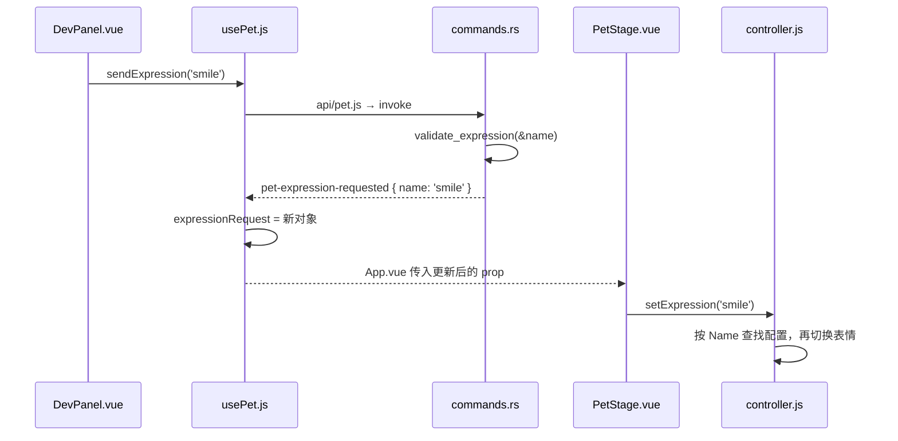

# 第三步：让八千代出现，让 Rust 事件控制真实表情

这一阶段接上了 Live2D：模型显示在 Canvas 中，使用库自带的眨眼、呼吸和物理更新，四个按钮开始控制真实表情。当前仍是普通窗口，方便观察模型和联调面板。

## 先体验

```powershell
cd D:\AnChiProject\yachiyodesktop\app
pnpm install --frozen-lockfile --registry=https://registry.npmjs.org
pnpm tauri dev
```

等“模型已就绪”出现后点击四种表情。下方记录 Rust 收到并发送的事件，画布下方显示交给模型的表情名。点击“重新加载”，模型会重新创建，并恢复最近一次表情。

这里的“30 FPS”表示设置的帧率上限，不是实时测量仪。常驻性能和隐藏停更在第五阶段实测。

## 先读两个文件

| 文件 | 负责什么 | 先看哪里 |
|---|---|---|
| [PetStage.vue](../../app/src/components/PetStage.vue) | Vue 的 Canvas、加载状态、重试、监听表情和组件清理 | `loadModel()`、`watch()`、`onUnmounted()` |
| [controller.js](../../app/src/live2d/controller.js) | 读取资源、创建模型、切表情、缩放、停止与释放 | `loadPet()` 和它返回的对象 |

你可以把 `PetStage.vue` 理解成“摆放画布并管理它的组件”，把 `controller.js` 理解成“操作模型的工具”。组件只调用几个方法，不需要了解 Cubism 的内部渲染代码。

```javascript
const controller = await createPetController({ canvas, modelDirectory, signal })
await controller.setExpression('smile')
controller.resize(388, 380)
controller.destroy()
```

这里的 `canvas` 是真实 DOM 元素，`modelDirectory` 是 Tauri 解析出的磁盘目录。`signal` 用来告诉尚未完成的加载：组件已经卸载，不要再把结果交给它。

控制器还保留了 `setRunning(boolean)` 和 `setMaxFps(15或30)`，之后接显示状态和省电设置时可以直接使用。当前没有给它们增加额外的设置页面。

## 一次表情变化经过哪里



第二阶段的 Rust 命令与事件格式没有改。新增的是收到事件之后的最后一段：`usePet` 保存请求，`PetStage` 观察它，再调用控制器。

现在 [App.vue](../../app/src/App.vue) 只调用一次 `usePet()`，把同一份状态交给模型组件和面板。生产模式隐藏面板时，事件监听仍然存在，之后 Rust 托盘可以继续用同一条事件控制模型。

每次事件都生成 `{ name, sequence }` 新对象，是为了连续两次点击“微笑”也能触发 Vue 的 `watch`。如果模型正在加载，就只保留最新请求；完成后应用它，避免恢复时把积压的表情逐个播放。

`setExpression` 接收名称，在 `model3.json` 的 `Expressions` 中查找下标。这样配置里的表情顺序调整后，按钮仍然指向正确表情。名称检查和布局计算放在 [modelConfig.js](../../app/src/live2d/modelConfig.js)，可以独立测试。

## 模型是怎样加载的

1. `index.html` 先加载 `public/live2d/live2dcubismcore.min.js`，提供底层 Cubism Core。
2. `resolveResource('assets/models/yachiyo')` 找到当前程序的模型资源目录。
3. `readTextFile` 读取固定的 `yachiyo.model3.json`，检查它引用的文件是否存在。
4. `join` 拼出磁盘路径，`convertFileSrc` 转成 WebView 能读取的资源 URL。
5. `CubismSetting.redirectPath` 把这些 URL 交给 easy-live2d。
6. 创建 Pixi `Application` 和 `Live2DSprite`，启动首次绘制，再等待 `model.ready`。
7. 根据容器大小设置模型缩放和位置。

先启动、再等待 `ready` 是这个库的特点：首次绘制才开始初始化，反过来等会一直卡住。

实际资源在 [src-tauri/assets/models/yachiyo](../../app/src-tauri/assets/models/yachiyo)。Tauri 开发构建会复制到 `target/debug/assets/models/yachiyo`；发布时由资源配置处理，因此代码里没有写死开发机的绝对路径。

## 这次 Rust 只增加了一项能力

[lib.rs](../../app/src-tauri/src/lib.rs) 新增：

```rust
.plugin(tauri_plugin_fs::init())
```

它注册现成的文件系统插件，让 JS 可以通过 Tauri 读取本地模型配置。依赖声明在 `Cargo.toml`，前端对应依赖是 `@tauri-apps/plugin-fs`。

[capabilities/default.json](../../app/src-tauri/capabilities/default.json) 只允许查询和读取模型目录内的文件；[tauri.conf.json](../../app/src-tauri/tauri.conf.json) 配置 `bundle.resources` 和同一目录的 `assetProtocol.scope`。前者负责随程序携带模型，后者让 WebView 加载模型的二进制文件和贴图。

所以这次没有把模型参数逐帧传给 Rust。Rust 提供本地资源和命令能力，JS 在 WebView 的 WebGL Canvas 中更新、绘制模型。

## 为什么把 8K 贴图缩成 4K

原始 `yachiyo/` 保留不动，FFmpeg 只生成运行副本。两张 PNG 都是 **4096×4096 RGBA**；`yachiyo.8192` 文件夹名称暂时保留，以兼容原配置中的相对路径。

| 两张贴图 | 基础 RGBA8 像素数据 |
|---|---:|
| 8192×8192 | 512 MiB |
| 4096×4096 | 128 MiB |

计算是 `宽 × 高 × 4 字节 × 2 张`。它说明缩小分辨率的收益，但不是进程内存实测。库还会生成 mipmap；完整 mipmap 链通常额外增加约三分之一，模型、WebView 和其他缓冲区也会占内存。

**只把 PNG 文件压得更小，主要减少磁盘和加载传输体积；降低像素尺寸，才会降低这部分解码后纹理占用。** 当前两张运行 PNG 合计约 10.6 MiB，不能把这个数字当成显存。

## 生命周期和一个依赖补丁

每个组件实例只保留一个控制器。`ResizeObserver` 跟随容器尺寸；卸载时取消观察，停止 Pixi ticker，销毁模型、纹理和 Application。异步加载按顺序进行，旧实例清理后才进入下一次创建，避免碰到 Cubism 的全局状态。

重试时 Vue 会通过 `canvasKey` 创建一个新 Canvas。原因是 Pixi 销毁时会释放旧 WebGL 上下文；直接重复使用旧画布曾导致重试一直停在加载状态。

渲染库锁定 `easy-live2d 0.4.4`、`pixi.js 8.20.1`。检查并运行后发现 easy-live2d 有两处需要补齐：加载错误不能完整传递给 `ready`，销毁时漏掉底层模型的 `release()`。修复保存在 [依赖补丁](../../app/patches/easy-live2d@0.4.4.patch)，由 `pnpm-workspace.yaml` 和锁文件记录，安装时自动应用。你目前不需要阅读那份第三方编译代码；之后升级依赖时需要重新核对补丁是否仍适用。

本模型没有动作文件，当前使用库已有的呼吸、眨眼和物理逻辑。更新和绘制由同一个 Pixi 渲染 ticker 驱动，没有另外加 `setInterval` 或 `requestAnimationFrame`。

## 你的本阶段练习

打开 `controller.js`，找到：

```javascript
const modelZoom = 2.6
```

把它改为 `2.3` 并保存，观察模型变小；再恢复成 `2.6`。这个倍率用来处理原始模型画布的大面积留白。它改变角色在窗口里的大小，PNG 文件尺寸不会变化。

然后点一次“微笑”，按上面的调用图跟踪一遍。能解释“Rust 已经返回成功”和“模型已经应用表情”的区别，就掌握了这一阶段最重要的部分。

## 验证

```powershell
pnpm test
pnpm build
cargo test --manifest-path src-tauri/Cargo.toml
cargo fmt --manifest-path src-tauri/Cargo.toml -- --check
```

自动测试覆盖模型引用文件、路径约束、按名称寻找表情、等比居中布局，以及第二阶段的 Rust 表情校验。桌面验证检查真实模型和表情、重新加载、资源出错和恢复。完整常驻性能数据留到第五阶段。

2026-09-10 验证记录：

- JavaScript 4 个测试、Rust 2 个测试、Rust 格式检查和前端生产构建通过。构建仍有一个 JS 分块超过 500 kB 的体积提示，主要包含渲染依赖，当前未继续拆包。
- 实际 Tauri 窗口显示模型，四种表情可切换，轮廓没有不透明背景；多次重新加载和开发热更新后模型恢复。
- 临时移走开发构建目录的一张贴图，界面显示文件路径；恢复后重试成功。
- 用新文件名引用损坏 PNG，绕开 WebView 缓存，界面显示纹理加载错误；恢复配置后重试成功。所有测试副本已清除，源模型没有改动。
- 模型未就绪时先选 smile 再选 teardrop，恢复后应用 teardrop，事件总数仍为 2，没有重复订阅导致的额外事件。
- 在相同窗口尺寸切换 4K 与原始 8K 贴图，脸部和轮廓未见明显差异；继续使用 4K，暂不制作 2K。这是当前小尺寸下的观感比较，不代表放大后完全相同。

参考：[Tauri 资源](https://v2.tauri.app/develop/resources/)、[文件系统插件](https://v2.tauri.app/plugin/file-system/)、[easy-live2d](https://panzer-jack.github.io/easy-live2d/guide/basic-usage.html)、[Pixi ticker](https://pixijs.com/8.x/guides/components/application/ticker-plugin)。
