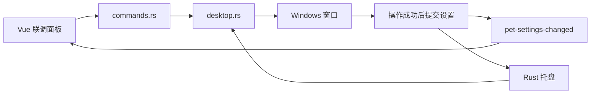

# 第四步：透明桌宠窗口与 Rust 托盘

这一阶段让八千代显示在透明无边框窗口中，并把显示、隐藏、置顶、表情、帧率和退出放进 Windows 系统托盘。仍然只有一个 Vue 窗口。

## 先运行和体验

```powershell
cd D:\AnChiProject\yachiyodesktop\app
pnpm tauri dev
```

- 按住角色拖动，移动的是 Windows 窗口。
- 鼠标进入桌宠区域时显示小工具栏；开发版可以打开“联调”，查看设置版本、表情事件和错误。
- 右键系统托盘里的八千代图标打开菜单；图标可能在右下角的折叠区。左键图标会显示并聚焦桌宠。
- “显示桌宠”的勾选代表当前显示状态；“保持置顶”和帧率也有对应勾选。
- 点击“隐藏”或按 `Alt+F4` 时，托盘仍然保留，可以找回角色。
- “退出八千代”和画布下方的“退出”会结束应用。

当前窗口是 340×440 个逻辑像素。联调面板覆盖在同一个窗口中，收起后继续显示角色；打开面板不会创建第二份模型或第二组事件监听。

## 本次最值得读的三个 Rust 文件

| 文件 | 一句话职责 |
|---|---|
| [settings.rs](../../app/src-tauri/src/settings.rs) | 定义设置，校验帧率，保证操作失败时不提交新状态 |
| [desktop.rs](../../app/src-tauri/src/desktop.rs) | 操作真正的窗口，提交设置后通知 Vue 和托盘 |
| [tray.rs](../../app/src-tauri/src/tray.rs) | 创建原生菜单，把点击转换成既有的窗口操作和表情事件 |

[commands.rs](../../app/src-tauri/src/commands.rs) 继续作为 JavaScript 的入口；[lib.rs](../../app/src-tauri/src/lib.rs) 把这三个模块接进 Tauri。

## 先看一条熟悉的调用链

在 Vue 联调面板中取消“保持置顶”时：

```text
DevPanel.vue
  → usePet.setAlwaysOnTop(false)
  → api/pet.js：invoke('set_pet_always_on_top', { enabled: false })
  → commands.rs：set_pet_always_on_top
  → desktop.rs：update_settings
  → Windows 设置置顶状态
  → 更新 Rust 中的设置和 revision
  → 发送 pet-settings-changed，更新托盘勾选
  → Vue 收到快照，更新面板
```

如果从 Rust 托盘点击“保持置顶”，会直接进入 `desktop::update_settings`。因此两个入口最终走同一个函数，不会一边显示“已置顶”、另一边还保留旧设置。



四个表情仍然使用第二、三阶段的 `request_expression` 和 `pet-expression-requested`。托盘不需要重新实现一套 Live2D 操作。

## settings.rs 里的 Rust 语法

```rust
pub type PetState = Mutex<PetSettings>;
```

`type` 是类型别名：以后写 `PetState` 就代表 `Mutex<PetSettings>`。它没有创建新库。

`PetSettings` 是普通结构体；`Mutex` 让共享状态在同一时刻只被一个调用修改。Tauri 管理这份状态，因此这里不用再包一层 `Arc`。

```rust
#[serde(rename_all = "camelCase")]
pub struct PetSettings {
    pub revision: u64,
    pub visible: bool,
    pub max_fps: u32,
    pub always_on_top: bool,
}
```

Rust 使用 `max_fps`、`always_on_top`；序列化给 JavaScript 后变成 `maxFps`、`alwaysOnTop`。对应对象是：

```javascript
{ revision: 0, visible: true, maxFps: 30, alwaysOnTop: true }
```

`impl Default for PetSettings` 定义初始值，`.manage(PetState::default())` 把它交给 Tauri 保存。本阶段只保存在内存里，重启恢复默认设置。

```rust
pub enum SettingsChange {
    Visible(bool),
    MaxFps(u32),
    AlwaysOnTop(bool),
}
```

`enum` 表示这次操作只能是这些种类中的一种，每种还能带参数。例如 `SettingsChange::MaxFps(15)` 表示“把帧率改成 15”。这样一个入口可以处理三种操作，同时每种参数仍有明确类型。

`update()` 先复制一份候选设置、检查帧率，再执行窗口操作；成功才增加版本号并写回。如果 Windows 操作返回 `Err`，`?` 会提前返回，原设置保持不变。

```rust
apply_window: impl FnOnce() -> Result<(), String>
```

这表示接收“一个调用一次、返回成功或错误的函数”，可以先理解成 JavaScript 里的回调。生产环境传入真实窗口操作，测试传入一个返回错误的函数，验证失败时不会把 `visible` 错记成 `false`。

## 为什么有 revision

初始化快照、命令返回和托盘事件都是异步消息，抵达顺序不一定相同。例如：

1. Vue 开始读取初始设置，版本为 0。
2. 托盘切换至 15 FPS，Vue 先收到了版本 1 的事件。
3. 较慢的初始请求返回版本 0。

如果每次直接覆盖，第 3 步会把界面改回 30 FPS。[petSettings.js](../../app/src/composables/petSettings.js) 用版本比较避免这种回退：旧版本丢弃，新版本或同版本接受。

[usePet.js](../../app/src/composables/usePet.js) 先订阅事件，再读取快照。事件和命令返回都交给同一个 `acceptSettings()`，组件卸载时清除全部订阅。

## 为什么要先解锁，再发送事件

`desktop.rs` 中大括号内负责拿锁、操作窗口和更新数据。离开大括号，Rust 自动释放锁；之后才发事件和更新菜单。

这样通知代码不会一直占用共享设置的锁，也更容易看清哪几行在修改状态。系统操作成功、但通知失败时会记录错误；命令仍返回已经提交的快照，Vue 可以通过返回值拿到正确设置。

## 透明和拖动分别在哪里

[tauri.conf.json](../../app/src-tauri/tauri.conf.json) 配置原生窗口：

```json
{
  "transparent": true,
  "decorations": false,
  "shadow": false,
  "skipTaskbar": true,
  "alwaysOnTop": true
}
```

同时 CSS 的 `html`、`body`、`#app`、角色容器背景设为透明；Pixi 的 `backgroundAlpha` 已在第三阶段设为 0。这几个层面同时透明，才能看见角色后面的桌面。

`PetStage.vue` 的 Canvas 接收鼠标按下事件，然后通过 `api/pet.js` 调用 Tauri 内置的 `getCurrentWindow().startDragging()`。[capabilities/default.json](../../app/src-tauri/capabilities/default.json) 增加了 `core:window:allow-start-dragging` 权限。

这里没有新增自己的 `drag_window` Rust 命令，因为 Tauri 已经提供这项能力。按钮位于 Canvas 外，点击按钮不会同时触发拖动。

## 关闭、隐藏、退出的区别

`desktop::on_window_event` 监听 `CloseRequested`。托盘存在时先调用 `prevent_close()` 阻止默认关闭，再执行隐藏。显式“退出”调用 `app.exit(0)`，结束整个应用。

只有托盘创建成功才启用关闭转隐藏。创建失败时 `lib.rs` 恢复原生边框和任务栏入口，隐藏命令也会拒绝执行；这样仍然能通过关闭按钮退出。

## 这一阶段与性能阶段的边界

30/15 FPS 菜单已接到同一个模型控制器的 `setMaxFps()`，改变的是更新与绘制的帧率上限，画布文字只是设置显示。

本阶段主要验证窗口与托盘。主动隐藏、最小化时明确停止 ticker，以及恢复的时间基准和 Release 内存/CPU/GPU 采样，留在第五阶段统一处理。当前不据此宣称后台占用已经达标。

## 你的练习

在 `tray.rs` 中找到“退出八千代”，改成“八千代去休息”。保持菜单 ID `"quit"` 不变，保存并等待 Rust 重新编译，然后右键托盘查看新文案。

再给 `handle_menu()` 的 `"quit"` 分支添加一行 `println!("[Rust] 八千代去休息了");`，点击菜单并观察终端。菜单文案和执行逻辑都在 Rust 里，这正是原生托盘与 Vue 网页按钮的区别。

## 验证入口

```powershell
pnpm test
pnpm build
cargo fmt --manifest-path src-tauri/Cargo.toml -- --check
cargo test --manifest-path src-tauri/Cargo.toml
```

本次新增测试覆盖：系统操作失败不提交设置、非法帧率被拒绝、有效操作更新版本且保留其他字段，以及异步旧快照不覆盖新设置。原有模型配置和表情测试继续运行。

2026-09-10 当前验证记录：

- JavaScript 7 个测试、Rust 5 个测试通过，Rust Clippy（`-D warnings`）和前端生产构建通过；构建仍有渲染依赖分块超过 500 kB 的体积提示。
- 实际窗口显示透明角色，无原生边框；打开和收起联调面板、取消置顶、切换至 15 FPS、发送 smile 均已观察到对应结果，设置版本依次更新为 1、2，表情事件增加 1 次。
- 桌面自动化的拖动与弹出菜单输入不稳定；托盘全部菜单、关闭后恢复和退出已请求用户手动核对，尚未收到结果。跨不同缩放显示器的拖动尚未验证；不把这些项目记为通过。
- 发现并修复第三阶段的一个清理边界：任一贴图失败时，原先的 `Promise.all` 会提前失败，另一张贴图随后可能访问已释放的 WebGL 上下文。补丁改为等待所有贴图完成后再抛出错误；回归测试先复现提前失败，再验证修复。

回归测试只针对固定版本的第三方加载器，放在 `loaderRecovery.test.js`。学习窗口与 Rust 通信时可以先跳过它，升级 easy-live2d 时再一起复核。

参考：[Tauri 系统托盘](https://v2.tauri.app/learn/system-tray/)、[窗口自定义与拖动权限](https://v2.tauri.app/learn/window-customization/)、[Rust 共享状态](https://v2.tauri.app/develop/state-management/)。
