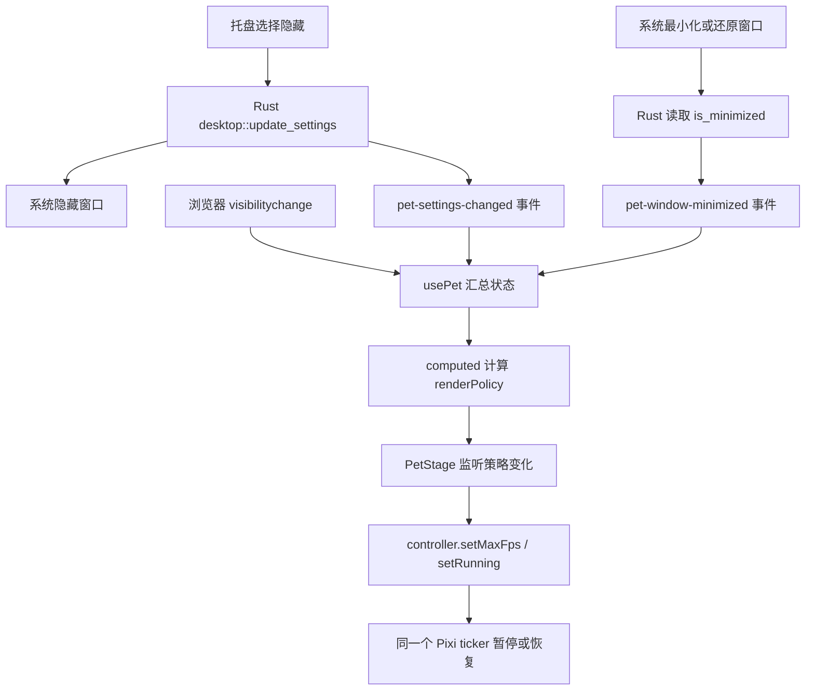

# 第五步：控制常驻开销

这一阶段的核心是让“是否运行”和“每秒最多运行多少次”分开。日常代码仍然只有一条模型更新与绘制循环；隐藏时保留已加载的模型，停止这条循环，显示时继续使用它。

## 先读这三个地方

1. [renderPolicy.js](../../app/src/live2d/renderPolicy.js)：根据状态做决定。
2. [usePet.js](../../app/src/composables/usePet.js)：收集 Rust 和浏览器的状态。
3. [controller.js](../../app/src/live2d/controller.js)：执行暂停、恢复与帧率上限。

纯函数只有几行：

```javascript
export function selectRenderPolicy(nativeVisible, pageVisible, maxFps, minimized = false) {
  return { running: nativeVisible && pageVisible && !minimized, maxFps }
}
```

这里的 `nativeVisible` 来自 Rust 的设置，表示用户是否要求显示桌宠；`pageVisible` 来自 `document.visibilityState`；`minimized` 来自原生窗口的实际状态。三个条件都允许显示才运行。切换到 VS Code、浏览器或其他窗口并不等于隐藏，所以没有把 `blur` / `focus` 放进条件。

`maxFps` 即使暂停也保留。例如用户选了 15 FPS，隐藏再恢复后仍然是 15 FPS。

## Rust 与 JavaScript 这次怎样联动



[desktop.rs](../../app/src-tauri/src/desktop.rs) 增加的逻辑很小：Windows 发出窗口尺寸变化事件后，读取 `is_minimized()`，通过 `emit` 发给前端。

```rust
if let WindowEvent::Resized(_) = event {
    match window.is_minimized() {
        Ok(minimized) => {
            let _ = window.emit("pet-window-minimized", minimized);
        }
        Err(error) => { /* 记录并通知窗口错误 */ }
    }
}
```

`if let` 表示“只有事件属于这个类型时才执行”；`match` 区分系统调用成功与失败；`let _ =` 表示这里有意忽略事件发送的返回值。发送的载荷就是 `true` 或 `false`，跨语言传递后仍然是 JavaScript 布尔值。

这个窗口回调不去锁 `PetState`：执行窗口操作的另一条调用链可能已经持锁，回调再等同一把锁容易相互等待。帧率和显示设置仍由已有的窗口服务管理。

[api/pet.js](../../app/src/api/pet.js) 封装事件监听和初始最小化查询。`usePet` 先监听，再查询初值；如果查询期间已经来了新事件，就保留事件给出的状态。组件卸载时会取消这些监听，也移除页面的 `visibilitychange` 监听。

## 暂停为什么不是隐藏 Canvas

把 Canvas 设为 `display: none` 只改变页面显示，不能保证运行库的模型计算停止。这里直接调用：

```javascript
app.stop()
```

当前锁定版本的实际调用链是 Pixi 渲染 → Live2DSprite 的 `onRender` → 模型更新 → 模型绘制。停止 Application 的 ticker，就停止了这条调用链。不能只因为构造参数写了 `ticker` 就认定它已生效；本次同时检查了依赖源码和实际 update/draw 计数。

暂停不调用 `destroy()`，因此不需要下次重新读 PNG、创建 WebGL 纹理或解析模型。真正卸载时，才停止循环、取消 ResizeObserver 和监听、释放模型、纹理与 Application。

## 恢复时为什么要重置时钟

模型每次更新需要知道“距离上一帧经过了多少秒”。假如隐藏了两分钟，再直接用现在时间减去旧时间，就可能把两分钟一次性交给物理和动画计算。

恢复顺序是：

```javascript
model.resetTime()
app.ticker.lastTime = performance.now()
app.start()
```

已有的 easy-live2d 补丁新增 `resetTime()`；内部时钟改用 `performance.now()`，首帧时间增量为 0，其后异常长帧最多推进 0.1 秒。`performance.now()` 适合计算经过时间，不依赖用户修改系统日期后的墙上时间。暂停期间的时长不会累计到下一帧。

两项时钟测试直接提取已安装依赖中的真实 `TimeManager` 执行，覆盖首次启动、暂停五分钟后恢复、长帧和负时间差；三项策略测试覆盖隐藏、最小化、页面不可见与 15 FPS 恢复。

## 如何理解测量指标

| 指标 | 代表什么 | 本阶段会怎样影响它 |
|---|---|---|
| PNG 文件字节数 | 磁盘与分发体积 | 无损压缩主要影响这里 |
| 解码后的纹理数据 | 宽 × 高 × 每像素字节数 | 缩小贴图尺寸才直接减少基础纹理数据 |
| CPU | 主程序和 WebView2 子进程花在计算上的时间 | 30 → 15 FPS 减少更新次数；隐藏后停更 |
| Working Set | 当前驻留在物理内存的进程页面 | 进程求和可能重复计算共享页面 |
| Private Bytes | 进程私有的已提交虚拟内存 | 适合辅助观察增长，不等于实际占用 RAM |
| GPU 专用/共享内存 | Windows 对这些进程的 GPU 内存记账 | 暂停保留纹理，所以不要求变为零 |

两张 4096×4096 的 RGBA8 基础纹理合计 **128 MiB**；两张 8192×8192 合计 **512 MiB**。这是基础数据量的计算，实际还包括 mipmap、渲染目标、驱动和浏览器资源，不能用它冒充整应用实测内存。

CPU 按“进程树消耗的 CPU 时间 ÷ 经过时间 ÷ 逻辑处理器数”计算为整机百分比。单看 `yachiyo-desktop.exe` 会漏掉大部分 WebView2 渲染开销。

## 可重复的 Release 验收

专项工具放在独立文件里，初学时可以先跳过：

- [performanceProbe.js](../../app/src/live2d/performanceProbe.js)：包住真实的模型更新/绘制方法，记录计数和恢复步长，每 5 秒上报一次。
- [audit.rs](../../app/src-tauri/src/audit.rs)：通过同一个窗口服务切换显示与 FPS，并记录原生状态。
- [measure-performance.ps1](../../app/scripts/measure-performance.ps1)：读取桌宠及其 WebView2 子进程的 CPU、内存和 Windows GPU 内存计数器。
- [summarize-performance.mjs](../../app/scripts/summarize-performance.mjs)：汇总原始 JSONL，排除每阶段开头 10 秒的切换边界。

测量构建不打开 DevTools，不启动 Vite 开发服务器。完整流程包括预热、30/15 FPS 各 2 分钟、隐藏 2 分钟、最小化 2 分钟、20 次隐藏/显示、30 分钟可见待机，完成后退出测量程序。连续待机阶段如果被隐藏、最小化、切换帧率或采样停顿打断，当前脚本会记录错误并退出，不会生成完成标记。

```powershell
# 在 app/ 内，先关闭已有的桌宠实例
$env:VITE_PERF_AUDIT = '1'
pnpm tauri build --no-bundle --features perf-audit
Remove-Item Env:VITE_PERF_AUDIT
./scripts/measure-performance.ps1 -OutputDirectory ../docs/performance/my-run
node scripts/summarize-performance.mjs ../docs/performance/my-run
```

每次测量使用新的输出目录。测量时保持当前显示环境，避免休眠、锁屏和手动切换桌宠状态。采样自身有小量额外开销，所以结果明确标注为带探针的 Release 构建。

正常使用只运行 `pnpm tauri dev`。普通发布构建不启用 Rust 的 `perf-audit` 特性，也不设置 `VITE_PERF_AUDIT`：Vite 会排除探针模块，没有每 5 秒上报的定时器。

本次 [实测记录](../performance/2026-09-10/README.md) 中，30/15 FPS 实际约为 29.49/14.90 次每秒，整组进程平均 CPU 为 4.64%/3.17%；隐藏和最小化后的实际更新、绘制计数都停止，CPU 在采样精度下约为 0%。20 次隐藏/显示也已完成。

30 分钟连续待机在约第 6.5 分钟被额外隐藏打断。用户选择先看代码和短阶段实测，长时间测试稍后再做；测量程序已经关闭。这段混合了显示与隐藏的数据不用于“30 分钟内存稳定”结论。

本阶段通过 12 个 JavaScript 测试、5 个 Rust 业务测试，以及启用 `perf-audit` 时的 2 个验收状态测试；Clippy 也通过。普通前端构建已核对不含探针。

## 自己做一个小练习

启动 `pnpm tauri dev`，打开联调面板，在 30 和 15 FPS 之间切换，观察动作流畅度与任务管理器中整组进程的占用。隐藏桌宠后从托盘恢复，确认保留原来的帧率。

然后给 `renderPolicy.test.js` 增加一个用例：**用户选择 15 FPS、窗口可见，但系统已经最小化**。预期是什么？写完运行 `pnpm test`。这个练习只改 JavaScript 测试，就能检查自己是否理解四个输入，而无需修改 Rust 或模型代码。
